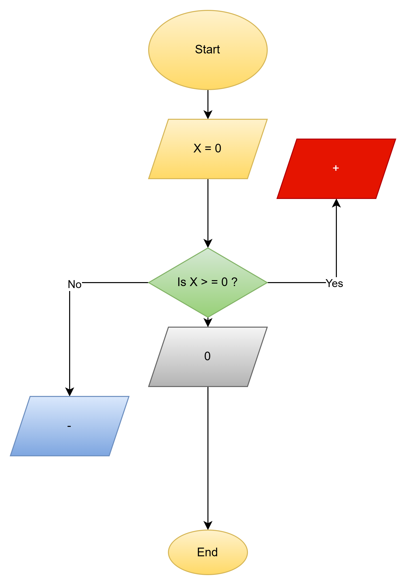

# Workshop: Algorithms and Flowchart
´´´text
This is a workshop with 10 task, beginning will be on 2

## 2. Calculate Total and Avreage Marks
´´´text
Write the algorithm and draw the flowchart for a program that inputs
marks for 3 subjects, calculates the total and average, and displays
both.

### Algorithms
´´´ text
Total, count = 0
Reapet
  print"Input a Number"
  Read Number
  Total = Total + Number
  Count = Count +1
  Until cont= 3
Average = Total/ 3
   Print Average
´´´

### ✔Pseudocode
´´´ text
Start  
       Input Number
       IF Number > = 3 Then
          Prit Even
       Else
          Print Average
End
´´´
                  
### ✔ Flowchart

 

- - -

## 3.  Display Multiplication Table
´´´text
Create an algorithm and flowchart that input a number and display its
multiplication table from 1 to 10 using a loop.
´´´

### Algorithms
´´´ tex
Begin 
For i Form 1 to 10 Do
      For j Form 1 to 10 Do
      Print i * j
      Print "" (space)
      End For 
      Print Newline 
      End For
      End

            
´´´

### ✔ Pseudocode
´´´ text
Start
    

### ✔ Flowchart
https://github.com/AEF21/workshop-19-feb/blob/2eb510fee9e41cccdbf9a56064d7adde32b22c42/image-2.png

## 4. Positive, Negative, or Zero Check

Write the algorithm and flowchart to input a number and display whether
it is positive, negative, or zero.
´´´
---

### Algorithms
´´´ text

  
´´´

### ✔Pseudocode
´´´ text
Start
X=0
  if X> 0?
  yes: display +
  No: display -
  whether is 0 grad
  End
´´´
### ✔ Flowchart

---

## 5. Simple Interest Calculator

Create an algorithm and flowchart for a program that calculates simple
interest using the formula:

**SI = (P × R × T) / 100**

- **P = Principal** → original amount of money
- **R = Rate of Interest** → percentage per year
- **T = Time** → number of years

### Algorithems
´´´text

**SI = (P × R × T) / 100**
Input a program:
- **P = Principal** → original amount of money
Input a program:
- **R = Rate of Interest** → percentage per year
Input a program:
- **T = Time** → number of years
calculates simple
interest using the formula:
**SI = (P × R × T) / 100**
Display the calculated result (SI)
Stop the Program

### ✔Pseudocode
´´´text
Start
Number (P,R,T,SI)
Print "Enter pricibal Ammount:"
Input P

Print "Enter Rate of Interest:"
Input R

Print "Enter Time (in years):"
Input T
SI = (P* R* T) / 100
Print " The Simple iereset is :",
SI
End
### ✔ Flowchart

---
## 6. Average Temperature Calculation

Write the algorithm and draw the flowchart for a program that takes the
temperature of 7 days, finds the average temperature, and displays it.

´´´
### Algorithms
´´´´
Text
- ** T = Temperature
- ** D = Day
Avg=( Sum T* / Sum D*)

Total count = 1 to 7
      Print:"Enter Your Number"
      Read Number
      If Number <7 
      Yes:next=Number
      End If 
            Count = count <==7
     Avg=( Sum T* / Sum D*)
     Display = Avg Result
     End
     ´´´
### ✔Pseudocode
´´´Text
1. Start
2. Set i = 1, avg=(sum / 7)
3. While i <= 7 do
    Input N
  Avg= 1 to 7
    i = i + 1
    End While
4. Display Avg Result
5. End
### ✔ Flowchart
 
---

## 7. Calculate Area of a Rectangle

Create an algorithm and flowchart to input length and width, calculate
the area (**Area = Length × Width**), and display the result.

### Algorithms
´´´TextBEGIN

1. Start
2. Set i = (**Area = Length × Width**)
3. Input =( Length N x Width N)
4. count Area= Result
5. Display Area
6. End

 ### ✔Pseudocode
 ´´´text
    1. START
    2. Input values
    Input Length
    Input Width
    3. Count Area
    Area = Length x Width
    4. Output Result
    OutPut "Area = ", Area
END

### ✔ Flowchart

---

## 8. Determine Pass or Fail

Write the algorithm and draw the flowchart for a program that takes a
student's average marks and displays **"Pass"** if average ≥ 50,
otherwise **"Fail"**.

### Algorithms
´´´Text
Start
Enter Number
Read Number
gread Pass if 
not if average ≥ 50
End

´´´

 ### ✔Pseudocode
START
    INPUT marks
        If avg ≥ 50
        Yes Print "fail"
        No Display "Pass"

END
### ✔ Flowchart

---

## 9. Calculate Factorial of a Number

Write the algorithm and draw the flowchart that input a number and
calculate its factorial using a loop.

### Algorithms
1. Start
2. Input a number N
3. Set Factorial to 1
4. Set Counter to 1
5. While Counter is less than or equal to N, do the following:
       a. Multiply Factorial by Counter
       b. Increase Counter by 1
6. Display the value of Factorial
7. End

### ✔Pseudocode
BEGIN

    INPUT N
    SET Factorial ← 1
    SET Counter ← 1

    WHILE Counter ≤ N DO
        Factorial ← Factorial × Counter
        Counter ← Counter + 1
    END WHILE

    OUTPUT "Factorial =", Factorial

END

---
### ✔ Flowchart

## 10. Calculate Discount on Purchase

Write the algorithm and draw the flowchart for a program that inputs the
purchase amount and gives a **10% discount** if the amount is greater
than 1000.

### Algorithms
1. Start
2. Input the purchase amount
3. If the amount is greater than 1000, calculate a 10% discount
4. Subtract the discount from the purchase amount
5. Otherwise, keep the amount unchanged
6. Display the final amount
7. End

 ### ✔Pseudocode
BEGIN

    INPUT PurchaseAmount

    IF PurchaseAmount > 1000 THEN
        Discount ← PurchaseAmount × 0.10
        FinalAmount ← PurchaseAmount − Discount
    ELSE
        FinalAmount ← PurchaseAmount
    END IF

    OUTPUT "Final Amount =", FinalAmount

END
### ✔ Flowchart

END

---
